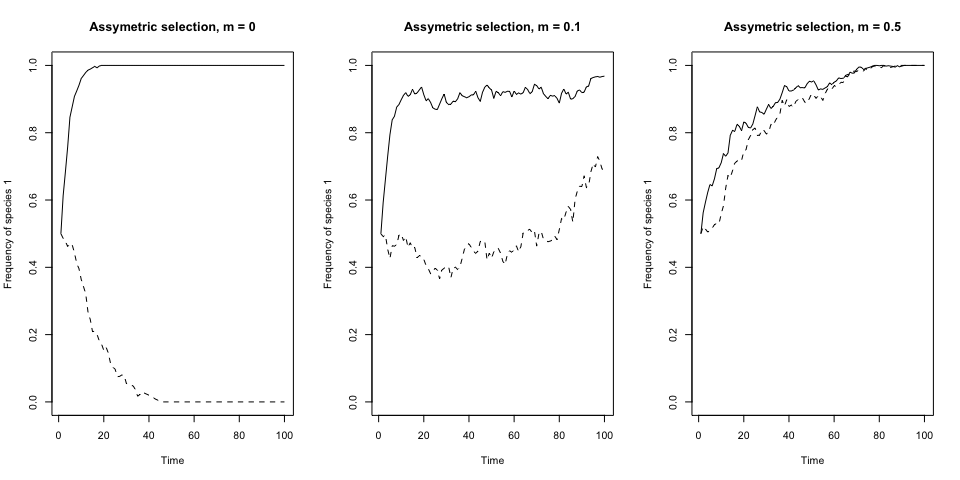
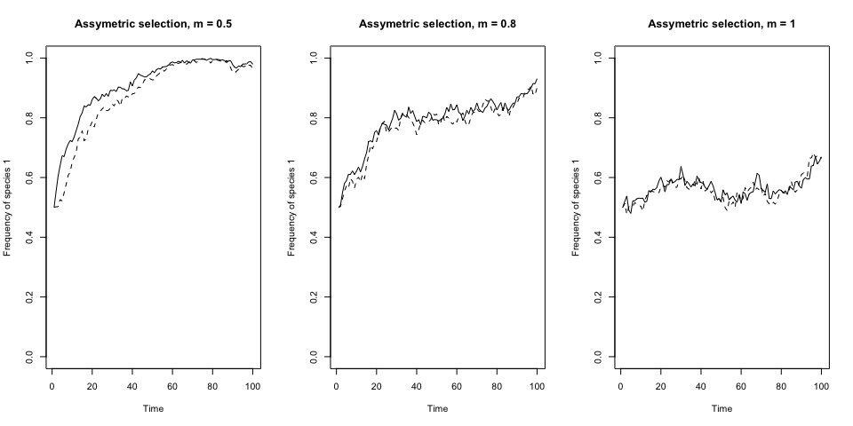
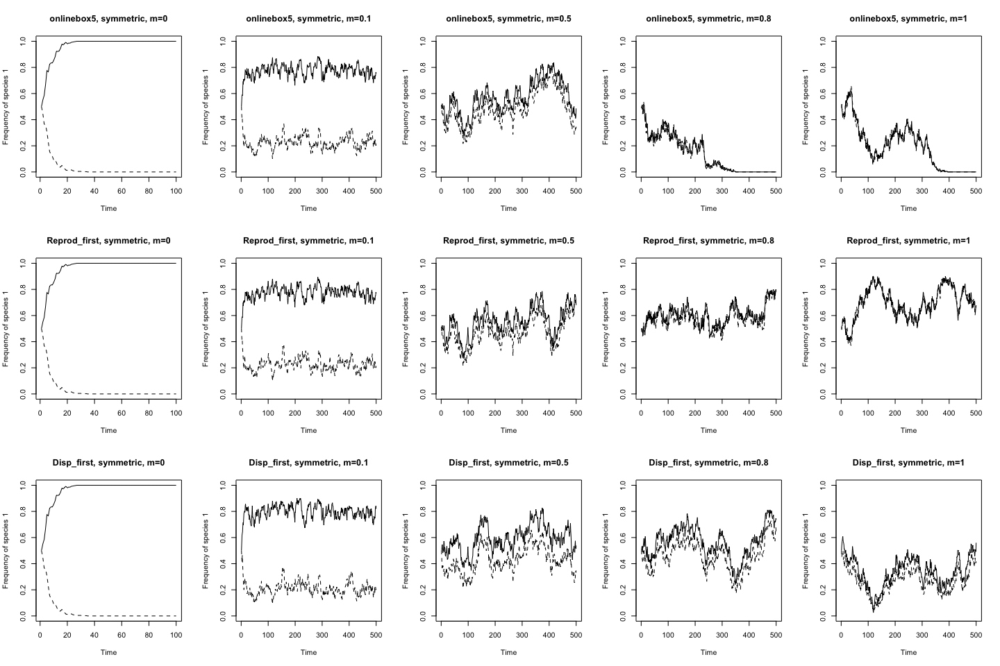
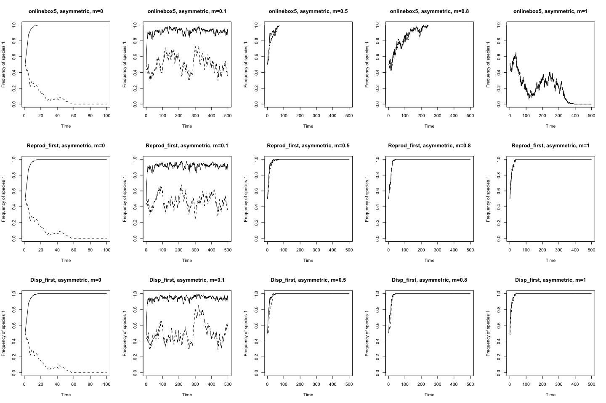

Online Box 5: Unexpected behaviour during high dispersal
================
Melissa Chen

### Chapter 6.4.2: Interaction of Dispersal and Selection

In section 6.4.2 (Interaction of Dispersal and Selection), the book describes a scenario where there are multiple patches with either symmetric or assymetric selection of species across patches. The text explains that when there is symmetric (dis)advantages across patches, increased dispersal () promotes coexistance. This is visualized in Figure 6.8. In the complementary code for this simulation (online box 5), dispersal is coded by allowing each loop to either (a) draw from the metacommunity or (b) draw from the local community (runif(1)&gt;m). Since the probability of drawing from the metacommunity is set by , the 'amount' of dispersal is a (stochastic) proportion of loops drawn from the metacommunity instead of the local community.

However, there is a subtle conceptual problem with the code for drawing from the metacommunity: when m is 1 (dispersal is unlimited), there is no selection occurring. If , the probability of each death being replaced by a recruit of species 1 is simply equal to the frequency of species 1 in the metacommunity. Thus, when , the code essentially models drift.

To illustrate this, let us first set up a function that encompasses the code from online box 5.

``` r
# First, let's make a function with the code from online box 5 so that we can change parameters with ease.
# The ONLY adjustments made to the code are:
# -- included a init.1.prop variable so we can change the starting frequency of species 1
# -- included a fit.ratio.avg.var variable so we can change the fitness ratios
# -- all constants are now inputs for the function. I've commented out original code so you can see changes that were made.

onlinebox5 <- function(num.years=50, num.patch=10, J=100, init.1.prop=0.5, fit.ratio.avg.var=1, m=0) {
    ## specify parameters, initial conditions, and output matrix
    # num.years <- 50 
    # num.patch <- 10
    freq.1.mat <- matrix(nrow = num.years, ncol = num.patch)
    
    # J <- 100 # number of individuals PER PATCH
    # init.1 <- 0.5*J 
    init.1 <- init.1.prop*J
    COM <- matrix(nrow=J, ncol=num.patch)
    COM[1:init.1,] <- 1; COM[(init.1+1):J,] <- 2 
    
    year <- 2 
    
    # m <- 0
    fit.ratio.avg <- vector(length=num.patch)
    #fit.ratio.avg[] <- 1
    fit.ratio.avg[] <- fit.ratio.avg.var
    freq.dep <- vector(length=num.patch)
    freq.dep[] <- 0
    
    ## record data (frequency of species 1) for year 1
    freq.1.mat[1,] <- init.1/J 
    
    ## run simulation
    for (i in 1:(J*num.patch*(num.years-1))) {
      
      ## choose a patch where a death even will occur
      patch <- sample(1:num.patch,1)
      
      ## calculate Pr.1 if dispersal occurs
      if (runif(1) < m) {
        Pr.1 <- sum(COM==1)/(J*num.patch)
      } else { 
    
      ## calculate Pr.1 if local reproduction (not dispersal)
        freq.1 <- sum(COM[,patch]==1)/J; freq.2 <- 1 - freq.1
        fit.ratio <- exp(freq.dep[patch]*(freq.1-0.5) + log(fit.ratio.avg[patch]))
        Pr.1 <-  fit.ratio*freq.1/(fit.ratio*freq.1 + freq.2)
      }
      
      COM[ceiling(J*runif(1)),patch] <- sample(c(1,2), 1, prob=c(Pr.1,1-Pr.1)) 
    
      ## record data  
      if (i %% (J*num.patch) == 0) {
        freq.1.mat[year,] <- colSums(COM==1)/J
        year <- year + 1 
      }
    } 
    
    ## graph the results
    plot(1:num.years, freq.1.mat[,1], type="l", xlab="Time", 
         ylab="Frequency of species 1", ylim=c(0,1))
    for (i in 2:(num.patch)) {
      lines(1:num.years,freq.1.mat[,i], type="l", lty=2, ylim=c(0,1))
    }
}
```

The text explains that when selection is assymetrical, the frequency of species 1 in patch 1 will "save" itself from becoming extinct in patch 2. In the book, Figure 6.9 is simulated identically to the figure below. We see that as  increases, species 1 in patch 1 (where it is strongly favoured) "saves" or "pulls" the frequency of species 1 away from extinction in patch 2.

``` r
##### m=0.5, J=1000, num.years = 100, num.patch=2 fit.ratio.avg[] <- c(1.5,(1/1.1)) #####
# This simulation is identical to the simulation ran in Figure 6.9
set.seed(512314)
par(mfrow=c(1,3))
onlinebox5(m=0, J=1000, num.years=100, num.patch=2, fit.ratio.avg.var=c(1.5,(1/1.1)))
title(main="Assymetric selection, m = 0")
onlinebox5(m=0.1, J=1000, num.years=100, num.patch=2, fit.ratio.avg.var=c(1.5,(1/1.1)))
title(main="Assymetric selection, m = 0.1")
onlinebox5(m=0.5, J=1000, num.years=100, num.patch=2, fit.ratio.avg.var=c(1.5,(1/1.1)))
title(main="Assymetric selection, m = 0.5")
```



The text also states that as dispersal increases farther, species 2 is expected to go extinct because it is, on average, less fit than species 1. However, the behaviour of species frequences are not as expected if we continue to increase dispersal to 1 (unlimited dispersal):

``` r
##### m=1, J=1000, num.years = 100, num.patch=2 fit.ratio.avg[] <- c(1.5,(1/1.1)) #####
# Try increasing m to 1
set.seed(512314)
par(mfrow=c(1,3))
onlinebox5(m=0.5, J=1000, num.years=100, num.patch=2, fit.ratio.avg.var=c(1.5,(1/1.1)))
title(main="Assymetric selection, m = 0.5")
onlinebox5(m=0.8, J=1000, num.years=100, num.patch=2, fit.ratio.avg.var=c(1.5,(1/1.1)))
title(main="Assymetric selection, m = 0.8")
onlinebox5(m=1, J=1000, num.years=100, num.patch=2, fit.ratio.avg.var=c(1.5,(1/1.1)))
title(main="Assymetric selection, m = 1")
```



What we see is that as  increases, species 2 never goes extinct! This is because as  increases to 1, the loop enters the "local" selection process fewer and fewer times. When , the code only draws from the metacommunity and all assymetric (or symmetric, for that matter) selective advantages between patches is never taken into account during the calculation of .

This means is we must be careful about how sampling from the metacommunity occurs. The current code models metacommunity sampling as drift-like process. In order to fix this, we must incorporate fitness differences into the calculation of  in the metacommunity sampling loop (when runif(1)&lt;m).

### How to code for selection when sampling from the metacommunity

Selection occurs because species that are more suited to the environment (have higher fitness) will contribute more (through reproduction) to the pool of potential new recruits. The recruit that replaces an individual is chosen randomly from a weighted pool of potential new recruits, where the 'weighting' is calculated through fitness differences. When there is only one patch, reproductive output of individuals from each species (I.E. how the pool of recruits is weighted) can only be determined by the environmental conditions of that patch.

However, when we draw recruits from the metacommunity, the location where reproduction occurs becomes important. If individuals reproduce in their own patch and their offspring are dispersed into neighbouring patches (such as in plants who disperse their seeds), species will contribute to the total metacommunity pool after fitness differences manifest. In contrast, if individuals arrive at a new patch and then reproduce (such as in animals that migrate as adults and then reproduce), all individuals of a species will contribute the same to the pool of new recruits from the metacommunity, but the local fitness ratios of the patch where species are being recruited will influence reproduction rates. Below are examples of both of these scenarios and the associated code modifications.

#### Scenario one: Reproduction occurs before dispersal

If reproduction occurs before dispersal, then new recruit contributions from the metacommunity must be weighted within each patch to account for patch-level fitness differences. I'll call this the "reproduction-first model". If there are two patches with fitness ratios of  and  in patches 1 and 2, respectively, then draws from the metacommunity should be calculated as follows, where subscripts refer to species ( is the frequency of species 1) and superscripts refers to patch ( is the frequency of species 1 in patch 2):


From this equation, we see that the probability of a successful new recruit being from species 1 is equal to its average frequency across all patches weighted by both population size and fitness differences within each patch. Note that in the code from online box 5 patches are not permitted to be different population sizes but I include this detail here since it is relevant for other online boxes (E.g. Online box 8). We can therefore edit the code from online box 5 as follows:

``` r
# Here, we edit the code from online box 5 to include weighted recruits from the metacommunity

onlinebox5_reprod_first <- function(num.years=50, num.patch=10, J=100, init.1.prop=0.5, fit.ratio.avg.var=1, m=0) {
    ## specify parameters, initial conditions, and output matrix
    # num.years <- 50 
    # num.patch <- 10
    freq.1.mat <- matrix(nrow = num.years, ncol = num.patch)
    
    # J <- 100 # number of individuals PER PATCH
    # init.1 <- 0.5*J 
    init.1 <- init.1.prop*J
    COM <- matrix(nrow=J, ncol=num.patch)
    COM[1:init.1,] <- 1; COM[(init.1+1):J,] <- 2 
    
    year <- 2 
    
    # m <- 0
    fit.ratio.avg <- vector(length=num.patch)
    #fit.ratio.avg[] <- 1
    fit.ratio.avg[] <- fit.ratio.avg.var
    freq.dep <- vector(length=num.patch)
    freq.dep[] <- 0
    
    ## record data (frequency of species 1) for year 1
    freq.1.mat[1,] <- init.1/J 
    
    ## run simulation
    for (i in 1:(J*num.patch*(num.years-1))) {
      
      ## choose a patch where a death even will occur
      patch <- sample(1:num.patch,1)
      
      ## calculate Pr.1 if dispersal occurs
      if (runif(1) < m) {
        # Calculate weighted average of contributions from species one in each patch
        # Pr.1 <- sum(COM==1)/(J*num.patch) # Replace this line with the following code:
        Pr.1.weighted <- 0
        for ( p in 1:num.patch ) {
            freq.1 <- sum(COM[,p]==1)/J; freq.2 <- 1-freq.1
            fit.ratio <- exp(freq.dep[p]*(freq.1-0.5) + log(fit.ratio.avg[p]))
            Pr.1 <- fit.ratio*freq.1/(fit.ratio*freq.1 + freq.2)
            Pr.1.weighted <- Pr.1.weighted + Pr.1*length(COM[,p])
        }
        Pr.1 <- Pr.1.weighted/length(COM)
      } else { 
      ## calculate Pr.1 if local reproduction (not dispersal)
        freq.1 <- sum(COM[,patch]==1)/J; freq.2 <- 1 - freq.1
        fit.ratio <- exp(freq.dep[patch]*(freq.1-0.5) + log(fit.ratio.avg[patch]))
        Pr.1 <-  fit.ratio*freq.1/(fit.ratio*freq.1 + freq.2)
      }
      
      COM[ceiling(J*runif(1)),patch] <- sample(c(1,2), 1, prob=c(Pr.1,1-Pr.1)) 
    
      ## record data  
      if (i %% (J*num.patch) == 0) {
        freq.1.mat[year,] <- colSums(COM==1)/J
        year <- year + 1 
      }
    } 
    
    ## graph the results
    plot(1:num.years, freq.1.mat[,1], type="l", xlab="Time", 
         ylab="Frequency of species 1", ylim=c(0,1))
    for (i in 2:(num.patch)) {
      lines(1:num.years,freq.1.mat[,i], type="l", lty=2, ylim=c(0,1))
    }
}
```

#### Scenario two: Reproduction occurs after dispersal

If reproduction occurs after dispersal, then new recruit contributions from the metacommunity will be subject to patch-level fitness differences in the recruiting patch. Let us call this the "dispersal-first model". For example, if dispersal occurs between two patches with fitness ratios of  and , respectively, the probability of an individual from species 1 successfully establishing itself as the new recruit in patch one is calculated as follows (subscripts represent species, superscripts represent patch number,  is frequency,  is population size, and  is the fitness ratio):


Here, total species frequencies from the metacommunity is used to calculate . Only the fitness ratio from the recruiting patch influences  because selection occurs after dispersal. The code from online box 5 can thus be altered as follows:

``` r
# Here, we edit the code from online box 5 to include weighted recruits from the metacommunity

onlinebox5_disp_first <- function(num.years=50, num.patch=10, J=100, init.1.prop=0.5, fit.ratio.avg.var=1, m=0) {
    ## specify parameters, initial conditions, and output matrix
    # num.years <- 50 
    # num.patch <- 10
    freq.1.mat <- matrix(nrow = num.years, ncol = num.patch)

    # J <- 100 # number of individuals PER PATCH
    # init.1 <- 0.5*J 
    init.1 <- init.1.prop*J
    COM <- matrix(nrow=J, ncol=num.patch)
    COM[1:init.1,] <- 1; COM[(init.1+1):J,] <- 2 
    
    year <- 2 
    
    # m <- 0
    fit.ratio.avg <- vector(length=num.patch)
    #fit.ratio.avg[] <- 1
    fit.ratio.avg[] <- fit.ratio.avg.var
    freq.dep <- vector(length=num.patch)
    freq.dep[] <- 0
    
    ## record data (frequency of species 1) for year 1
    freq.1.mat[1,] <- init.1/J 

    ## run simulation
    for (i in 1:(J*num.patch*(num.years-1))) {
      
      ## choose a patch where a death even will occur
      patch <- sample(1:num.patch,1)
      
      ## calculate Pr.1 if dispersal occurs
      if (runif(1) < m) {
        # Calculate weighted average of contributions from species one in each patch
        # Pr.1 <- sum(COM==1)/(J*num.patch) # Replace this line with the following code:
        freq.1 <- sum(COM==1)/length(COM); freq.2 <- 1 - freq.1
        fit.ratio <- exp(freq.dep[patch]*(freq.1-0.5) + log(fit.ratio.avg[patch]))
        Pr.1 <- fit.ratio*freq.1/(fit.ratio*freq.1 + freq.2)
      } else { 
      ## calculate Pr.1 if local reproduction (not dispersal)
        freq.1 <- sum(COM[,patch]==1)/J; freq.2 <- 1 - freq.1
        fit.ratio <- exp(freq.dep[patch]*(freq.1-0.5) + log(fit.ratio.avg[patch]))
        Pr.1 <-  fit.ratio*freq.1/(fit.ratio*freq.1 + freq.2)
      }
      
      COM[ceiling(J*runif(1)),patch] <- sample(c(1,2), 1, prob=c(Pr.1,1-Pr.1)) 
    
      ## record data  
      if (i %% (J*num.patch) == 0) {
        freq.1.mat[year,] <- colSums(COM==1)/J
        year <- year + 1 
      }
    } 
    
    ## graph the results
    plot(1:num.years, freq.1.mat[,1], type="l", xlab="Time", 
         ylab="Frequency of species 1", ylim=c(0,1))
    for (i in 2:(num.patch)) {
      lines(1:num.years,freq.1.mat[,i], type="l", lty=2, ylim=c(0,1))
    }
    
}
```

#### Comparing new code with online box 5

Below, I compare the modified code and models to the original.

``` r
par(mfrow=c(3,5))
# Symmetric
set.seed(532948)
onlinebox5(m=0, J=500, num.years=100, num.patch=2, fit.ratio.avg.var=c(1.2,(1/1.2)))
title(main="onlinebox5, symmetric, m=0")
onlinebox5(m=0.1, J=500, num.years=500, num.patch=2, fit.ratio.avg.var=c(1.2,(1/1.2)))
title(main="onlinebox5, symmetric, m=0.1")
onlinebox5(m=0.5, J=500, num.years=500, num.patch=2, fit.ratio.avg.var=c(1.2,(1/1.2)))
title(main="onlinebox5, symmetric, m=0.5")
onlinebox5(m=0.8, J=500, num.years=500, num.patch=2, fit.ratio.avg.var=c(1.2,(1/1.2)))
title(main="onlinebox5, symmetric, m=0.8")
onlinebox5(m=1, J=500, num.years=500, num.patch=2, fit.ratio.avg.var=c(1.2,(1/1.2)))
title(main="onlinebox5, symmetric, m=1")

# Reproduction before dispersal
set.seed(532948)
onlinebox5_reprod_first(m=0, J=500, num.years=100, num.patch=2, fit.ratio.avg.var=c(1.2,(1/1.2)))
title(main="Reprod_first, symmetric, m=0")
onlinebox5_reprod_first(m=0.1, J=500, num.years=500, num.patch=2, fit.ratio.avg.var=c(1.2,(1/1.2)))
title(main="Reprod_first, symmetric, m=0.1")
onlinebox5_reprod_first(m=0.5, J=500, num.years=500, num.patch=2, fit.ratio.avg.var=c(1.2,(1/1.2)))
title(main="Reprod_first, symmetric, m=0.5")
onlinebox5_reprod_first(m=0.8, J=500, num.years=500, num.patch=2, fit.ratio.avg.var=c(1.2,(1/1.2)))
title(main="Reprod_first, symmetric, m=0.8")
onlinebox5_reprod_first(m=1, J=500, num.years=500, num.patch=2, fit.ratio.avg.var=c(1.2,(1/1.2)))
title(main="Reprod_first, symmetric, m=1")

# Dispersal before reproduction
set.seed(532948)
onlinebox5_disp_first(m=0, J=500, num.years=100, num.patch=2, fit.ratio.avg.var=c(1.2,(1/1.2)))
title(main="Disp_first, symmetric, m=0")
onlinebox5_disp_first(m=0.1, J=500, num.years=500, num.patch=2, fit.ratio.avg.var=c(1.2,(1/1.2)))
title(main="Disp_first, symmetric, m=0.1")
onlinebox5_disp_first(m=0.5, J=500, num.years=500, num.patch=2, fit.ratio.avg.var=c(1.2,(1/1.2)))
title(main="Disp_first, symmetric, m=0.5")
onlinebox5_disp_first(m=0.8, J=500, num.years=500, num.patch=2, fit.ratio.avg.var=c(1.2,(1/1.2)))
title(main="Disp_first, symmetric, m=0.8")
onlinebox5_disp_first(m=1, J=500, num.years=500, num.patch=2, fit.ratio.avg.var=c(1.2,(1/1.2)))
title(main="Disp_first, symmetric, m=1")
```



When selection is symmetrical, we expect species frequences to reach an equilibrium as dispersal increases. In the original code (top row) we see this is not the case-- species very easily go extinct because drift is occuring when metacommunity sampling dominates. In the modified code where selection is included during metacommunity sampling, species frequencies are more stable at higher dispersal rates. Stability in both models (reproduction and establishment) is achieved through storage effects, where species are able to persist through "hard times" (when the patch chosen for recruitment does not favour them).

If we compare model performance when fitness differences are asymmetric, we get the following plots:

``` r
par(mfrow=c(3,5))
# Assymetric
set.seed(532948)
onlinebox5(m=0, J=500, num.years=100, num.patch=2, fit.ratio.avg.var=c(1.5,(1/1.1)))
title(main="onlinebox5, asymmetric, m=0")
onlinebox5(m=0.1, J=500, num.years=500, num.patch=2, fit.ratio.avg.var=c(1.5,(1/1.1)))
title(main="onlinebox5, asymmetric, m=0.1")
onlinebox5(m=0.5, J=500, num.years=500, num.patch=2, fit.ratio.avg.var=c(1.5,(1/1.1)))
title(main="onlinebox5, asymmetric, m=0.5")
onlinebox5(m=0.8, J=500, num.years=500, num.patch=2, fit.ratio.avg.var=c(1.5,(1/1.1)))
title(main="onlinebox5, asymmetric, m=0.8")
onlinebox5(m=1, J=500, num.years=500, num.patch=2, fit.ratio.avg.var=c(1.5,(1/1.1)))
title(main="onlinebox5, asymmetric, m=1")

# Selection at reproduction
set.seed(532948)
onlinebox5_reprod_first(m=0, J=500, num.years=100, num.patch=2, fit.ratio.avg.var=c(1.5,(1/1.1)))
title(main="Reprod_first, asymmetric, m=0")
onlinebox5_reprod_first(m=0.1, J=500, num.years=500, num.patch=2, fit.ratio.avg.var=c(1.5,(1/1.1)))
title(main="Reprod_first, asymmetric, m=0.1")
onlinebox5_reprod_first(m=0.5, J=500, num.years=500, num.patch=2, fit.ratio.avg.var=c(1.5,(1/1.1)))
title(main="Reprod_first, asymmetric, m=0.5")
onlinebox5_reprod_first(m=0.8, J=500, num.years=500, num.patch=2, fit.ratio.avg.var=c(1.5,(1/1.1)))
title(main="Reprod_first, asymmetric, m=0.8")
onlinebox5_reprod_first(m=1, J=500, num.years=500, num.patch=2, fit.ratio.avg.var=c(1.5,(1/1.1)))
title(main="Reprod_first, asymmetric, m=1")

# Selection at establishment
set.seed(532948)
onlinebox5_disp_first(m=0, J=500, num.years=100, num.patch=2, fit.ratio.avg.var=c(1.5,(1/1.1)))
title(main="Disp_first, asymmetric, m=0")
onlinebox5_disp_first(m=0.1, J=500, num.years=500, num.patch=2, fit.ratio.avg.var=c(1.5,(1/1.1)))
title(main="Disp_first, asymmetric, m=0.1")
onlinebox5_disp_first(m=0.5, J=500, num.years=500, num.patch=2, fit.ratio.avg.var=c(1.5,(1/1.1)))
title(main="Disp_first, asymmetric, m=0.5")
onlinebox5_disp_first(m=0.8, J=500, num.years=500, num.patch=2, fit.ratio.avg.var=c(1.5,(1/1.1)))
title(main="Disp_first, asymmetric, m=0.8")
onlinebox5_disp_first(m=1, J=500, num.years=500, num.patch=2, fit.ratio.avg.var=c(1.5,(1/1.1)))
title(main="Disp_first, asymmetric, m=1")
```



Previously, we discovered that when dispersal is too high, species 1 (which is asymmetrically advantaged) fails to "pull" species 2 to extinction in online box 5. This is shown in the first row. In both the modified models however, we see species 1 successfully pulling species 2 to extinction, as predicted by the text. Therefore, both models (reproduction or establishment) behave in the way we expect and accurately models dispersal between metacommunities.

There is a subtle difference in the way fitness differences manifest between the two modified models when . In the reproduction-first model, the recruiting patch does not influence the probability of either species being recruited. This is because reproductive output for each individual is determined independently within each patch first, and then combined. Instead, the recruiting patch will affect the probability of recruitment for the next round of recruitments because reproductive fitness of the new recruit will now depend on which patch it established in.

In the dispersal-first model, the recruiting patch strongly affects a species' probability of recruitment. The absolute frequency of each species in the metacommunity is used to calculated reproductive output given the fitness ratios of the recruiting patch. Thus, the recruiting patch has a strong influence on which species is successful during recruitment but a weak long-term affect on the number of future offspring produced by that individual. This is because when , reproductive output of an individual is no longer controlled by the patch within which it exsts.

Despite these differences, we do not see a large difference between these two models in their behaviour within the scope of the Vellend text.

### Summary

In summary, both the reproduction-first and dispersal-first models behave similarily in simulations attempted above. They both 'fix' the issue with the original code in online box 5 that prevented competitive exclusion by an assymetrically favoured species during high dispersal. The 'best' model (reproduction-first or dispersal-first) likely depends on the system of interest, but to our knowledge the choice between these two models to not significantly impact the outcome of most simulations.
