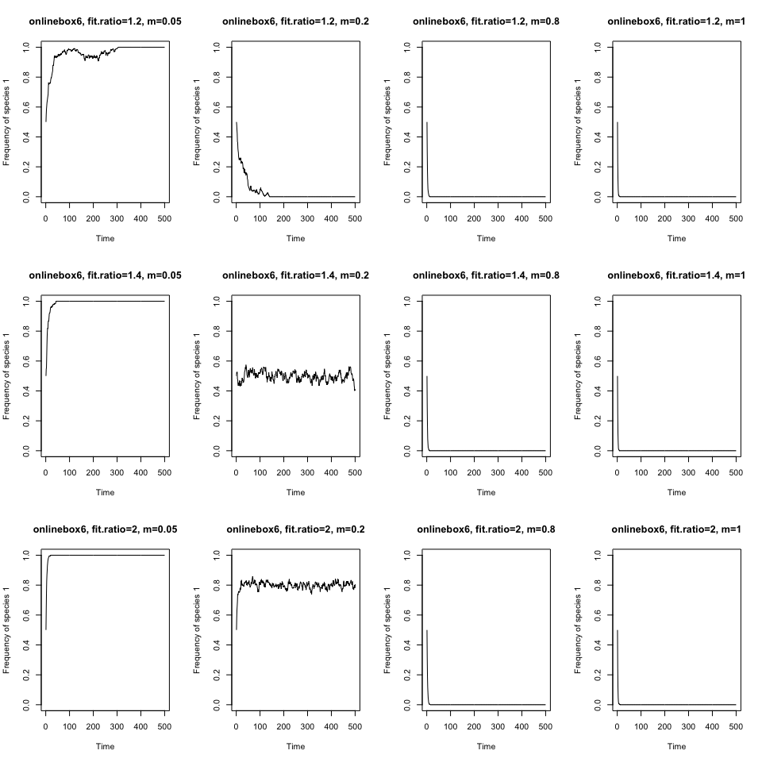
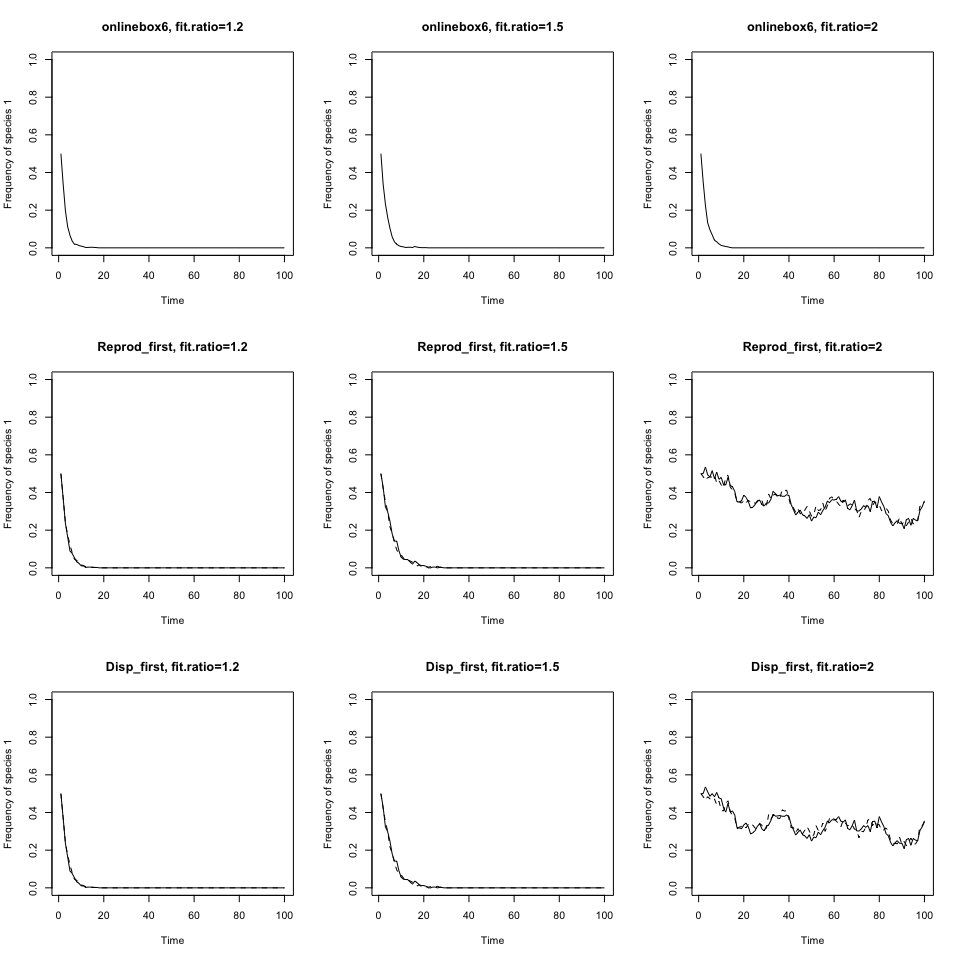

Online Box 6: Alterations to code to account for competition and colonization at high dispersal
================
Melissa Chen

In the document, "Online Box 5: Unexpected behaviour during high dispersal", we show how code from online box 5 does not allow fitness differences to affect reproductive outcomes when dispersal is high. This results in unexpected behaviour as *m* approaches 1. To remedy this unexpected behaviour, we previously show how selection can be incorporated into metacommunity sampling in two ways: (1) by assuming individuals' reproduce in their "home" patch and disperse their offspring into other patches, or (2) by assuming adult individuals disperse to new patches and then reproduce within the new patch. While different conceptually, both models behave similiarly and resolve the unexpected behaviour observed when dispersal is unlimited.

Below, we show how the code from online box 6 can also be altered to ensure selection occurs at the metacomunity scale. Again, we show two ways of incorporating fitness differences into the code although the behaviour is similiar between the two.

#### Adding dispersal ability

In section 6.4.3, the text discusses competition-colonization trade-offs as the conceptual difference between the code's fit.ratio and fit.ratio.m constants. The text states that diversity is promoted when species 1 is competitively superior (fit.ratio&gt;1) but species 2 is the superior disperser (fit.ratio.m&lt;1). The code provided by online box 6 shows that the probability of species 1 being the new recruit is equal to the total frequency of species 1 in the metacommunity adjusted by "fit.ratio.m". The original code (modified to be a function) is included below:

``` r
onlinebox6 <- function(num.years=500, num.patch=2, J=1000, init.1.prop=0.5, fit.ratio.avg.var=c(1.2,1.2), m=0.05, fit.ratio.m=1) {
# specify parameters, initial conditions, and output matrix
# num.years <- 500 
# num.patch <- 2 
freq.1.mat <- matrix(nrow = num.years, ncol = num.patch)

# J <- 1000 
init.1 <- init.1.prop*J # added a variable to be able to adjust initial proportion of species 1
COM <- matrix(nrow=J, ncol=num.patch)
COM[1:init.1,] <- 1; COM[(init.1+1):J,] <- 2 

year <- 2 

# m <- 0.05
fit.ratio.avg <- vector(length=num.patch)
fit.ratio.avg[] <- fit.ratio.avg.var
# fit.ratio.m <- 1/5
freq.dep <- vector(length=num.patch)
freq.dep[] <- 0

## record data (frequency of species 1) for year 1
freq.1.mat[1,] <- init.1/J 

## run simulation
for (i in 1:(J*num.patch*(num.years-1))) {

## choose a patch where a death even will occur  
patch <- sample(1:num.patch,1)

## calculate Pr.1 if dispersal occurs  
if (runif(1) < m) {
freq.1.meta <- sum(COM==1)/(J*num.patch)
Pr.1 <- fit.ratio.m*freq.1.meta/(fit.ratio.m*freq.1.meta + (1-freq.1.meta))
} else { 

## calculate Pr.1 if local reproduction (not dispersal)
freq.1 <- sum(COM[,patch]==1)/J; freq.2 <- 1 - freq.1
fit.ratio <- exp(freq.dep[patch]*(freq.1-0.5) + log(fit.ratio.avg[patch]))
Pr.1 <-  fit.ratio*freq.1/(fit.ratio*freq.1 + freq.2)
}

COM[ceiling(J*runif(1)),patch] <- sample(c(1,2), 1, prob=c(Pr.1,1-Pr.1)) 

## record data  
if (i %% (J*num.patch) == 0) {
freq.1.mat[year,] <- colSums(COM==1)/J
year <- year + 1 
}
} 

## graph the results
plot(1:num.years, rowMeans(freq.1.mat), type="l", xlab="Time", 
ylab="Frequency of species 1", ylim=c(0,1))
}
```

On page 86, the text says that if there is sufficient trade-off between colonization (fit.ratio.m) and competitive (fit.ratio) abilties, coexistence is possible even in spatially homogenous selection because some recruitment events will favour strong competitors (runif(1) &lt; m) and others will favour strong dispersers (runif(1) &gt; m).

Differences in competitive ability (no matter how small) will lead to competitive exclusion of the inferior competitor over time. However, coexistence between two species can occur within a metacommunity if the inferior competitor is a good disperser. Coexistence is therefore a balance between competitive ability and dispersal ability. In theory, a species that is competitively inferior can always be competitively excluded by an exceptionally strong competitor. However, in the original code from online box 6 we see that this is impossible:

``` r
par(mfrow=c(3,4))
onlinebox6(m=0.05, fit.ratio.avg.var = c(1.2,1.2), fit.ratio.m = 1/5)
title(main="onlinebox6, fit.ratio=1.2, m=0.05")
onlinebox6(m=0.2, fit.ratio.avg.var = c(1.2,1.2), fit.ratio.m = 1/5)
title(main="onlinebox6, fit.ratio=1.2, m=0.2")
onlinebox6(m=0.8, fit.ratio.avg.var = c(1.2,1.2), fit.ratio.m = 1/5)
title(main="onlinebox6, fit.ratio=1.2, m=0.8")
onlinebox6(m=1, fit.ratio.avg.var = c(1.2,1.2), fit.ratio.m = 1/5)
title(main="onlinebox6, fit.ratio=1.2, m=1")

onlinebox6(m=0.05, fit.ratio.avg.var = c(1.4,1.4), fit.ratio.m = 1/5)
title(main="onlinebox6, fit.ratio=1.4, m=0.05")
onlinebox6(m=0.2, fit.ratio.avg.var = c(1.4,1.4), fit.ratio.m = 1/5)
title(main="onlinebox6, fit.ratio=1.4, m=0.2")
onlinebox6(m=0.8, fit.ratio.avg.var = c(1.4,1.4), fit.ratio.m = 1/5)
title(main="onlinebox6, fit.ratio=1.4, m=0.8")
onlinebox6(m=1, fit.ratio.avg.var = c(1.4,1.4), fit.ratio.m = 1/5)
title(main="onlinebox6, fit.ratio=1.4, m=1")

onlinebox6(m=0.05, fit.ratio.avg.var = c(2,2), fit.ratio.m = 1/5)
title(main="onlinebox6, fit.ratio=2, m=0.05")
onlinebox6(m=0.2, fit.ratio.avg.var = c(2,2), fit.ratio.m = 1/5)
title(main="onlinebox6, fit.ratio=2, m=0.2")
onlinebox6(m=0.8, fit.ratio.avg.var = c(2,2), fit.ratio.m = 1/5)
title(main="onlinebox6, fit.ratio=2, m=0.8")
onlinebox6(m=1, fit.ratio.avg.var = c(2,2), fit.ratio.m = 1/5)
title(main="onlinebox6, fit.ratio=2, m=1")
```



Since the runif(1) loop chooses the first loop every time when *m* = 1, competitive fitness differences between species never manifest. This means the better competitor (as opposed to the better disperser) will always lose when *m* = 1 because differences in competitive ability are never considered in the code. To fix this problem, we can incorporate the changes we made to the code in online box 5 into online box 6 as well.

If reproduction occurs before dispersal, *P**r*.1 is calculated by first weighting local species frequencies by fitness differences, and then weighting those probabilites by dispersal ability differences.

``` r
onlinebox6_reprod_first <- function(num.years=500, num.patch=2, J=1000, init.1.prop=0.5, fit.ratio.avg.var=c(1.2,1.2), m=0.05, fit.ratio.m=1) {
# specify parameters, initial conditions, and output matrix
# num.years <- 500 
# num.patch <- 2 
freq.1.mat <- matrix(nrow = num.years, ncol = num.patch)

# J <- 1000 
init.1 <- init.1.prop*J # added a variable to be able to adjust initial proportion of species 1
COM <- matrix(nrow=J, ncol=num.patch)
COM[1:init.1,] <- 1; COM[(init.1+1):J,] <- 2 

year <- 2 

# m <- 0.05
fit.ratio.avg <- vector(length=num.patch)
fit.ratio.avg[] <- fit.ratio.avg.var
# fit.ratio.m <- 1/5
freq.dep <- vector(length=num.patch)
freq.dep[] <- 0

## record data (frequency of species 1) for year 1
freq.1.mat[1,] <- init.1/J 

## run simulation
for (i in 1:(J*num.patch*(num.years-1))) {

## choose a patch where a death even will occur
patch <- sample(1:num.patch,1)

## calculate Pr.1 if dispersal occurs
if (runif(1) < m) {
# Calculate weighted average of contributions from species one in each patch
Pr.1.weighted <- 0
for ( p in 1:num.patch ) {
freq.1 <- sum(COM[,p]==1)/J; freq.2 <- 1-freq.1
fit.ratio <- exp(freq.dep[p]*(freq.1-0.5) + log(fit.ratio.avg[p]))
freq.1.reprod <- fit.ratio*freq.1/(fit.ratio*freq.1 + freq.2)
Pr.1 <- fit.ratio.m*freq.1.reprod/(fit.ratio.m*freq.1.reprod + (1-freq.1.reprod))

Pr.1.weighted <- Pr.1.weighted + Pr.1*length(COM[,p])
}
Pr.1 <- Pr.1.weighted/length(COM)

# freq.1.meta <- sum(COM==1)/(J*num.patch)
# Pr.1 <- fit.ratio.m*freq.1.meta/(fit.ratio.m*freq.1.meta + (1-freq.1.meta))
} else { 

## calculate Pr.1 if local reproduction (not dispersal)
freq.1 <- sum(COM[,patch]==1)/J; freq.2 <- 1 - freq.1
fit.ratio <- exp(freq.dep[patch]*(freq.1-0.5) + log(fit.ratio.avg[patch]))
Pr.1 <-  fit.ratio*freq.1/(fit.ratio*freq.1 + freq.2)
}

COM[ceiling(J*runif(1)),patch] <- sample(c(1,2), 1, prob=c(Pr.1,1-Pr.1)) 

## record data  
if (i %% (J*num.patch) == 0) {
freq.1.mat[year,] <- colSums(COM==1)/J
year <- year + 1 
}
} 

## graph the results
plot(1:num.years, freq.1.mat[,1], type="l", xlab="Time", 
ylab="Frequency of species 1", ylim=c(0,1))
for (i in 2:(num.patch)) {
lines(1:num.years,freq.1.mat[,i], type="l", lty=2, ylim=c(0,1))
}
}
```

If dispersal occurs before reproduction then metacommunity species frequencies are weighted by dispersal ability differences first, then fitness differences in the recruiting patch are applied to calculate *P**r*.1.

``` r
onlinebox6_disp_first <- function(num.years=500, num.patch=2, J=1000, init.1.prop=0.5, fit.ratio.avg.var=c(1.2,1.2), m=0.05, fit.ratio.m=1) {
## specify parameters, initial conditions, and output matrix
# num.years <- 50 
# num.patch <- 10
freq.1.mat <- matrix(nrow = num.years, ncol = num.patch)

# J <- 100 # number of individuals PER PATCH
# init.1 <- 0.5*J 
init.1 <- init.1.prop*J
COM <- matrix(nrow=J, ncol=num.patch)
COM[1:init.1,] <- 1; COM[(init.1+1):J,] <- 2 

year <- 2 

# m <- 0
fit.ratio.avg <- vector(length=num.patch)
#fit.ratio.avg[] <- 1
fit.ratio.avg[] <- fit.ratio.avg.var
freq.dep <- vector(length=num.patch)
freq.dep[] <- 0

## record data (frequency of species 1) for year 1
freq.1.mat[1,] <- init.1/J 

## run simulation
for (i in 1:(J*num.patch*(num.years-1))) {

## choose a patch where a death even will occur
patch <- sample(1:num.patch,1)

## calculate Pr.1 if dispersal occurs
if (runif(1) < m) {
# Calculate weighted average of contributions from species one in each patch
# Pr.1 <- sum(COM==1)/(J*num.patch) # Replace this line with the following code:
freq.1 <- sum(COM==1)/length(COM); freq.2 <- 1 - freq.1
freq.1.disp <- fit.ratio.m*freq.1/(fit.ratio.m*freq.1 + freq.2)
fit.ratio <- exp(freq.dep[patch]*(freq.1.disp-0.5) + log(fit.ratio.avg[patch]))
Pr.1 <- fit.ratio*freq.1.disp/(fit.ratio*freq.1.disp + (1-freq.1.disp))
} else { 
## calculate Pr.1 if local reproduction (not dispersal)
freq.1 <- sum(COM[,patch]==1)/J; freq.2 <- 1 - freq.1
fit.ratio <- exp(freq.dep[patch]*(freq.1-0.5) + log(fit.ratio.avg[patch]))
Pr.1 <-  fit.ratio*freq.1/(fit.ratio*freq.1 + freq.2)
}

COM[ceiling(J*runif(1)),patch] <- sample(c(1,2), 1, prob=c(Pr.1,1-Pr.1)) 

## record data  
if (i %% (J*num.patch) == 0) {
freq.1.mat[year,] <- colSums(COM==1)/J
year <- year + 1 
}
} 

## graph the results
plot(1:num.years, freq.1.mat[,1], type="l", xlab="Time", 
ylab="Frequency of species 1", ylim=c(0,1))
for (i in 2:(num.patch)) {
lines(1:num.years,freq.1.mat[,i], type="l", lty=2, ylim=c(0,1))
}

}
```

Below, the performance of these models is compared with the original code

``` r
par(mfrow=c(3,3))
# Assymetric
set.seed(532948)
onlinebox6(m=1, J=500, num.years=100, num.patch=2, fit.ratio.avg.var=c(1.2,1.2), fit.ratio.m = 1/2)
title(main="onlinebox6, fit.ratio=1.2")
onlinebox6(m=1, J=500, num.years=100, num.patch=2, fit.ratio.avg.var=c(1.5,1.5), fit.ratio.m = 1/2)
title(main="onlinebox6, fit.ratio=1.5")
onlinebox6(m=1, J=500, num.years=100, num.patch=2, fit.ratio.avg.var=c(2,2), fit.ratio.m = 1/2)
title(main="onlinebox6, fit.ratio=2")

# Selection at reproduction
set.seed(532948)
onlinebox6_reprod_first(m=1, J=500, num.years=100, num.patch=2, fit.ratio.avg.var=c(1.2,1.2), fit.ratio.m = 1/2)
title(main="Reprod_first, fit.ratio=1.2")
onlinebox6_reprod_first(m=1, J=500, num.years=100, num.patch=2, fit.ratio.avg.var=c(1.5,1.5), fit.ratio.m = 1/2)
title(main="Reprod_first, fit.ratio=1.5")
onlinebox6_reprod_first(m=1, J=500, num.years=100, num.patch=2, fit.ratio.avg.var=c(2,2), fit.ratio.m = 1/2)
title(main="Reprod_first, fit.ratio=2")


# Selection at establishment
set.seed(532948)
onlinebox6_disp_first(m=1, J=500, num.years=100, num.patch=2, fit.ratio.avg.var=c(1.2,1.2), fit.ratio.m = 1/2)
title(main="Disp_first, fit.ratio=1.2")
onlinebox6_disp_first(m=1, J=500, num.years=100, num.patch=2, fit.ratio.avg.var=c(1.5,1.5), fit.ratio.m = 1/2)
title(main="Disp_first, fit.ratio=1.5")
onlinebox6_disp_first(m=1, J=500, num.years=100, num.patch=2, fit.ratio.avg.var=c(2,2), fit.ratio.m = 1/2)
title(main="Disp_first, fit.ratio=2")
```



In the above simulations we see that when *m* = 1, the original code (online box 6) never allows the superior competitor to win. In contrast, both modified codes (which include fitness differences during metacommunity sampling) allows increasing competitive differences to mitigate differences in dispersal abilities. Thus, the modified codes behave more intuitively than the original code.
